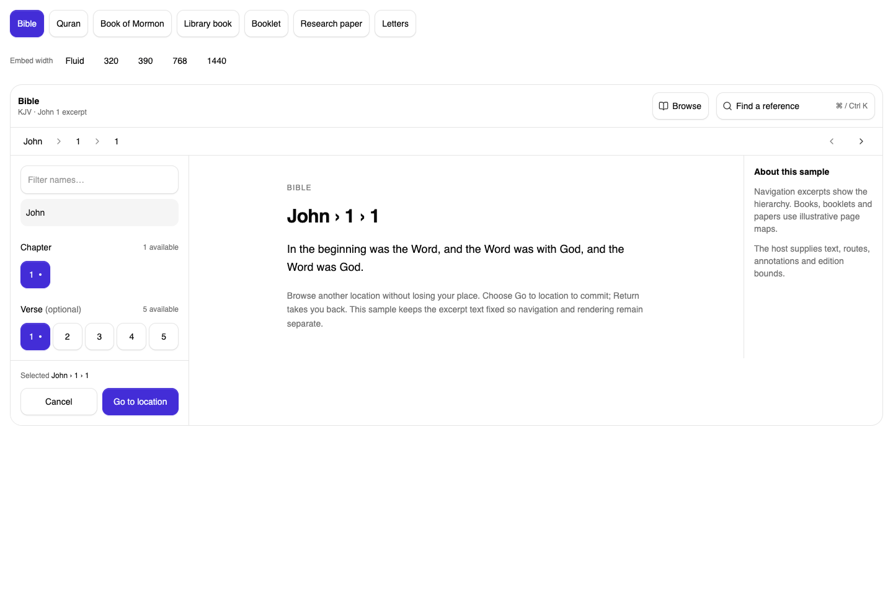
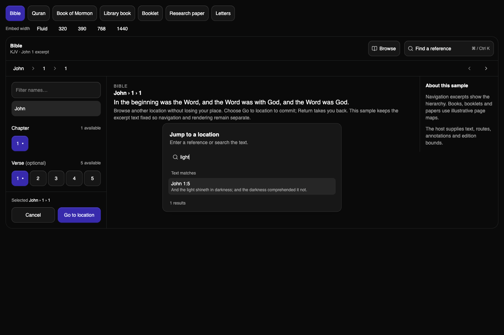

# Corpus navigation implementation verification

Part of epic #195; implementation stack #201 → #202 → #203 → #204 → final docs/package PR. Base: dev at 9ddc5f2. Draft stack; no merge, release or production deployment performed.

## Automated checks

- `make check`: passed (TypeScript project references and repository ESLint).
- `make test`: 528 passed, zero failures, across 55 files; includes 19 navigation tests.
- `make build`: passed, including Fumapress documentation and library declarations/bundle.
- `bun run check:consumer`: passed. After final implementation changes, rebuilt the library through `make build` and reran `bun scripts/check-consumer.ts`: passed against an actual tarball installed outside the workspace. Root/focused exports preserve identity; public example builds; compiled stylesheet and bundle contract pass.
- No new dependencies or lockfile changes.

Navigation regressions cover controlled/uncontrolled state, independent stores and IDs, read/action hooks, StrictMode cleanup, rejected controlled proposals, exact aliases and bounds, async request ordering/cancellation, return history, all six presets, custom hierarchy after numeric levels, 2,000-page bounded rendering, parent-change filter reset, keyboard focus/activation, shortcut ownership, resize with an open draft, and inherited/explicit/deferred portal destinations.

## Browser observations

Chromium 154 on macOS. Used the actual Fumapress pages and an isolated browser harness importing the same source components, shared provider and compiled library CSS. The harness adds only host demo typography utilities; it is not shipped.

| Check | Result |
| --- | --- |
| 1440 px wide container in docs; 1440 px viewport in isolated preview | Inline hierarchy, reading content and context; no document overflow |
| 768 px | Medium side drawer; commit restored Browse focus |
| 390 px viewport | RTL Quran bottom sheet; measured controls at least 44 px; no document overflow |
| 320 × 640 viewport | Sheet stayed within viewport; Go bottom at 624 px; no document overflow |
| 390 px embed inside 1440 px viewport | Compact presentation, correctly based on container |
| Search `light` and Enter | Text match John 1:5 committed; command closed and trigger regained focus |
| Draft selection, commit, Return | Reading anchor changed only on explicit commit; prior anchor restored |
| Light and dark | Inherited semantic backgrounds and foregrounds |
| Inherited primary overrides | Existing chart-2 and chart-3 token overrides changed control color; no hardcoded palette |
| Reduced motion | Computed drawer popup and backdrop transition property both `none`; Tree reduced branch duration is zero |
| 200% CSS zoom stress check | No document overflow; commit button remained inside viewport (bottom 928 / height 960) |

Native mobile virtual keyboards, assistive-technology narration, and real browser zoom controls were not exercised on physical devices. The zoom check above uses CSS zoom and is not a claim of physical-device/browser-zoom certification. Review those host-dependent interactions before treating every accessibility acceptance item as complete.

## Evidence

## Stack review and merge order

The repository PR workflow filters long-lived bases; feature-base child PRs do not run it. Review each child against its immediate parent, then retarget to dev after the parent lands and trigger fresh CI before merging. Do not treat absent feature-base checks as a pass. No CI policy was weakened to accommodate the stack.

The Sketch source and full design specification remain on `docs/corpus-navigation-spec`, under `specs/005-corpus-navigation/`. Presets and examples are excerpts; they do not bundle complete scripture databases or fabricate production page maps.
